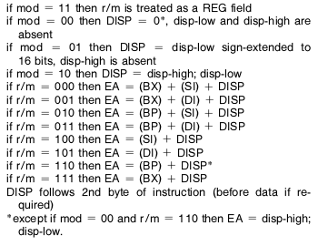

# Advanced OS and Virtualization

## How to Compile

Ensure the Go toolchain version 1.24.3 or newer is installed.
Installation instructions are found [here](https://go.dev/doc/install).

<details>
<summary>Regenerating operation_string.go (this should not be necessary.)</summary>

The code in file `operation_string.go` is automatically generated.
If necessary, it can be regenerated by running `go generate` from the project root.

For this to work, the `stringer` command has to be installed and on the `$PATH`:

(Note that the Go toolchain usually installs into the `$HOME/go/bin` directory.)

```sh
go install golang.org/x/tools/cmd/stringer@latest
whereis stringer # $HOME/go/bin/stringer
```

`operation_string.go` provides pretty printing needed for the disassembler.
</details>

To build the project, `cd` into the project root and run:

```sh
go build
```

This will produce a file called `mmvm`.

To use a custom name, build with the `-o` option:

```sh
go build -o interpreter
```

(This will produce an ELF executable named `interpreter`.)

## How to Run

The disassembler/interpreter accepts the same arguments as the `mmvm` reference implementation: `-m` for a debug trace, `-d` for disassembly.

**Assuming the program has been compiled using `go build`, which produced an executable named `mmvm`.**

```sh
./mmvm test_programs/1.out
```

will simply interpret the program `1.out` and result in the text "hello" being written to the console.

```sh
./mmvm -m test_programs/1.out
```

will interpret the program `1.out` while showing a debug trace, similar to:

```output
 AX   BX   CX   DX   SP   BP   SI   DI  FLAGS IP
0000 0000 0000 0000 ffce 0000 0000 0000 ---- 0000:31ed         xor bp, bp
0000 0000 0000 0000 ffce 0000 0000 0000 --Z- 0002:89e3         mov bx, sp
0000 ffce 0000 0000 ffce 0000 0000 0000 --Z- 0004:8b07         mov ax, [bx] ;[ffce]0001
0001 ffce 0000 0000 ffce 0000 0000 0000 --Z- 0006:8d5702       lea dx, [bx+2] ;[ffd0]ffd8
0001 ffce 0000 ffd0 ffce 0000 0000 0000 --Z- 0009:8d4f04       lea cx, [bx+4] ;[ffd2]0000
0001 ffce ffd2 ffd0 ffce 0000 0000 0000 --Z- 000c:01c1         add cx, ax
...
```

```sh
./mmvm -d test_programs/1.out
```

will produce a disassembly of `1.out`, similar to:

```output
0000: 31ed          xor bp, bp
0002: 89e3          mov bx, sp
0004: 8b07          mov ax, [bx]
0006: 8d5702        lea dx, [bx+2]
0009: 8d4f04        lea cx, [bx+4]
000c: 01c1          add cx, ax
...
```

To run all test files at once, you may use:

```sh
for i in {1..7}; do echo "---- $i: ----"; ./mmvm "test_programs/$i.out" foo bar baz; echo; done
```

(Notice the extra arguments `foo bar baz` provided on the command line!)

```output
---- 1: ----
hello

---- 2: ----
a
---- 3: ----
hello

---- 4: ----
a=1234

---- 5: ----
argv[0]=test_programs/5.out
argv[1]=foo
argv[2]=bar
argv[3]=baz

---- 6: ----
012345
---- 7: ----
long = 4
short = 2
int = 2

```

## Code Walkthrough

### Disassembler

We define a structure similar to the one defined in Minix2's `SYS/include/a.out.h`:

```go
type Exec struct {
	MidMag struct {
		Magic   [2]byte // needs to be 0x01 0x03
		Flags   byte    // 0x20 -> separate I/D (instruction/text and data)
		CPU     byte
		HdrLen  uint8
		Unused  byte
		Version uint16
	}
	SizeText   int32
	SizeData   int32
	SizeBSS    int32
	EntryPoint int32
	MemTotal   int32
	SizeSym    int32
	/* end of short form */
}

func (e Exec) BadMag() bool {
	return e.MidMag.Magic[0] != 0x01 || e.MidMag.Magic[1] != 0x03
}
```

In the `main` function, the entire `a.out` file is read into one contiguous chunck of memory:

```go
bin := must(os.ReadFile(file))
```

<details>
<summary>must</summary>

```go
func must[T any](t T, err error) T {
	if err != nil {
		panic(err)
	}
	return t
}
```

`must` is a helper function for *very* lazy programmers who don't want to handle errors.
</details>


It is then possible to cast a pointer to this memory to the `Exec` structure:

```go
exec := *(*Exec)(unsafe.Pointer(&bin[0]))
```

The problem with this approach is that it only works if the code has been compiled for and is being run on a little-endian computer (since the data in the `a.out` file itself is layed out in little-endian order).

Instead we can make use of the `encoding/binary` package, which provides a more portable solution:

```go
var exec Exec
if err := binary.Read(bytes.NewReader(bin), binary.LittleEndian, &exec); err != nil {
	log.Fatal(err)
}
```

The `a.out` file contains (amongst other things) a *text* and a *data* section.
We can extract the *text* and the *data* parts with the help of these two functions:

```go
func (e Exec) Text(bin []byte) []byte {
	s := int32(e.MidMag.HdrLen)
	text := bin[s : s+e.SizeText]
	return text
}

func (e Exec) Data(bin []byte) []byte {
	s := int32(e.MidMag.HdrLen)
	s += e.SizeText
	data := bin[s : s+e.SizeData]
	return data
}
```

The `text` section is then passed on to the `disassemble` function for disassembling:

```go
text := exec.Text(bin)
insts, err := disassemble(text)
_ = err // we'll ignore decode errors, just emit OpInvalid
for _, inst := range insts {
	fmt.Println(InstructionFormatterWithOffset{inst})
}
```

`disassemble` returns an array (technically a `slice`, in Go terminology) of disassembled instructions.

<details>
<summary>Go slices</summary>

A slice in go is a builtin data type, that consists of a pointer to the underlaying array, a length, and a capacity.

Slices are a bit weird, in as much as that they serve two different purposes.

A slice can be used as a *view* into an array.
A slice can also be used as a dynamic array (array list), to which elements can be appended using the builtin `append` function.
As appending to a slice might cause the underlying array to be relocated, `append` returns a new slice.

A slice must only ever be used as a view, or only ever as a dynamic array.
Trying to use a slice in both ways leads to bugs!
</details>

An instruction is defined as:

```go
type Instruction struct {
	offset, size int
	bytes        [6]byte
	operation    Operation
	operands     Operands
}
```

containing information such as the offset in the program's `text` where the instruction is found, the size of the instruction (never larger than 6), the bytes which make up the instruction, as well as the operation and operands encoded by this instruction.

`Operation` is an enum:

```go
type Operation int
//go:generate stringer -type=Operation -trimprefix=Op -linecomment
const (
	OpInvalid           Operation = iota // (undefined)
	OpMovRegRm                           // mov
	OpMovRmImm                           // mov
	OpMovRegImm                          // mov
	// <omitted for brevity...>
	OpPushRm                             // push
	OpPushReg                            // push
	// <omitted for brevity...>
)
```

<details>
<summary>Enums in Go</summary>

Go doesn't really have enums.
Instead, enums are encoded as a newtype (`type MyEnum int`) and a bunch of constants.
Constants can be "initialized" using `iota`, which will simply assign numbers in increasing order.
```go
type MyEnum int
const (
	Option1 MyEnum = iota
	Option2
	Option3
)
```
</details>

<details>
<summary>Code generating using `//go:generate`</summary>

Notice the line comment starting with `//go:generate stringer`.

The `Operation` enum values are just integers.
For pretty printing, we would like to give them names.
A newtype can specify its own pretty-printing format, by implementing the `fmt.Stringer` interface.

The `fmt.Stringer` interface defines a single method `String() string`:
```go
// go doc fmt.Stringer
type Stringer interface {
	String() string
}
```

We could manually implement this method:

```go
func (op Operation) String() string {
	switch op {
	case OpInvalid:
		return "(undefined)"
	case OpMovRegRm, OpMovRmImm, OpMovRegImm:
		return "mov"
	case OpPushRm, OpPushReg:
		return "push"
	// <other cases...>
	}
}
```

Or we save ourselves all this work and let the `stringer` tool auto-generate this code for us.
When running `go generate` from the command line, the source code is searched for lines such as `//go:generate stringer`.
This will cause the `stringer` tool to be invoked.
`stringer` generates a `String() string` implementation for us.

Pay attention to the comments (such as `// mov` and `// (undefined)`):
```go
OpInvalid           Operation = iota // (undefined)
OpMovRegRm                           // mov
OpMovRmImm                           // mov
```

These comments are **significant!**
They tell `stringer` what the enum value should be formatted as.
(`OpInvalid` is converted to the string `"(undefined)"`.
`OpMovRegRm` and `OpMovRmImm` are both converted to the same string `"mov"`.)
</details>

`Operands` is simply defined as a slice of `Operand`: `type Operands []Operand`.
There are different types of operands, therefore `Operand` is an interface:

```go
type Operand interface {
	fmt.Stringer
	W() byte
}
```

The `Operand` interface requires the same pretty-printing method from `fmt.Stringer` to be implemented, as well as a `W() byte` method, returning the operands width (0 -> 1 byte width, 1 -> 2 byte width).

Different types of operands include, registers:

```go
type Register struct {
	name, width byte
}
```

...memory:

```go
type Memory struct {
	width, mod, rm, dispHigh, dispLow byte
}
```

...immediates:

```go
type Immediate struct {
	width byte
	value uint16
}
```

...and a few more special cases.

Let's have a closer look at `Register`.
A register has a name and a width, both encoded by a `byte`.
```go
type Register struct {
	name, width byte
}
```
When pretty-printing, we want human readable names for the registers.
```go
func (reg Register) String() string {
	names := []string{"al", "cl", "dl", "bl", "ah", "ch", "dh", "bh", "ax", "cx", "dx", "bx", "sp", "bp", "si", "di"}
	return names[reg.name+reg.width*8]
}
```
`names` is an array of register names.
We use the formula `reg.name + (reg.width * 8)` to index into the names-array, to read out the proper name.
For example, the register identified by the byte `0b1` corresponds to the `cl` register, unless its width is a word (2 bytes), as indicated by `reg.width == 1`, in which case we have to skip 8 entries in the name array `+ reg.width * 8` to end up at `cx`.

Pretty-printing for `Memory` operands is more involved:

```go
func (mem Memory) String() string {
	names := []string{"bx+si", "bx+di", "bp+si", "bp+di", "si", "di", "bp", "bx"}
	switch mem.mod {
	default:
		panic("invalid mod")
	case 0b00:
		if mem.rm == 0b110 {
			disp := (int16(mem.dispHigh) << 8) ^ int16(mem.dispLow)
			return fmt.Sprintf("[%04x]", disp)
		}
		return "[" + names[mem.rm] + "]"
	case 0b01:
		return fmt.Sprintf("[%s%+x]", names[mem.rm], int16(int8(mem.dispLow)))
	case 0b10:
		disp := (int16(mem.dispHigh) << 8) ^ int16(mem.dispLow)
		return fmt.Sprintf("[%s%+x]", names[mem.rm], disp)
	case 0b11:
		panic("rm is reg")
	}
}
```

Depending on the `mod`, the disposition valuse have to be interpreted in different ways.
This method basically encodes what is described in the "NOTES:" section on the last page of the 8086 specification:



To come back to this piece of code:
```go
text := exec.Text(bin)
insts, err := disassemble(text)
_ = err // we'll ignore decode errors, just emit OpInvalid
for _, inst := range insts {
	fmt.Println(InstructionFormatterWithOffset{inst})
}
```

The disassembled instructions are printed to the console using an `InstructionFormatterWithOffset`.
There are two different instruction formatter implemented, as we want to pretty-print them in slightly different ways, depending on whether where doing a disassembly (`-d`) or a tracing (`-m`).
There is nothing special about these formatters otherwise, they are just simple structures that wrap around an `Instruction` and implement a `String() string` method.

---

To finally get to the actually interesting part: the disassembling.

There are various helper functions defined to decode common patterns, that are shared between many instructions.

```go
func decodeImmediate(src *Source, width byte) Immediate {
	var data uint16
	if width == 1 {
		b1 := src.Next()
		b2 := src.Next()
		data = (uint16(b2) << 8) ^ uint16(b1)
	} else {
		b1 := src.Next()
		data = uint16(b1)
	}
	return Immediate{width: width, value: data}
}
```

`decodeImmediate` reads, depending on the `width`, either one or two bytes from the instruction stream and decodes them as an `Immediate`.

```go
func decodeDisposition(src *Source) Immediate {
	b1 := src.Next()
	b2 := src.Next()
	disp := (uint16(b2) << 8) ^ uint16(b1)
	dispTotal := uint16(src.Pos) + disp
	return Immediate{width: 1, value: dispTotal}
}
```

`decodeDisposition` is used for instructions encoding an address as a relative offset.
(Which is why `src.Pos` is added to the decoded disposition, to obtain the effective address.)

There are a few more such helper functions, last but not least `decodeModRegRm`:

```go
func decodeModRegRm(src *Source, width byte) (oreg, orm Operand) {
	mod, reg, rm := MODREGRM(src.Next())
	oreg = Register{name: reg, width: width}
	switch mod {
	case 0b00:
		if rm == 0b110 {
			orm = Memory{width: width, mod: mod, rm: rm, dispLow: src.Next(), dispHigh: src.Next()}
		} else {
			orm = Memory{width: width, mod: mod, rm: rm}
		}
	case 0b01:
		orm = Memory{width: width, mod: mod, rm: rm, dispHigh: 0, dispLow: src.Next()}
	case 0b10:
		orm = Memory{width: width, mod: mod, rm: rm, dispLow: src.Next(), dispHigh: src.Next()}
	case 0b11:
		orm = Register{name: rm, width: width}
	}
	return oreg, orm
}
```

This too is a very common pattern used by many instructions on the 8086.
Depending on the value of `mod`, the subsequent bytes have to be decoded either as some sort of memory access or as a register.

The actual decoding is done in a function `decode`, comprising a total of 517 lines of code.

```go
func decode(src *Source) (inst Instruction, err error) {
	defer func() {
		if r := recover(); r != nil {
			// assumption: the only thing that could ever cause a panic is an array out-of-bounds access
			bs, offset, size := src.Consume()
			inst = Instruction{
				offset:    offset,
				size:      size,
				operation: OpInvalid,
				operands:  nil,
			}
			copy(inst.bytes[:], bs)
			err = errors.Join(err, errors.New("unexpected EOF"))
		}
	}()
	var (
		op  Operation
		opn Operands
	)
	switch i1 := src.Next(); {
	default:
		err = fmt.Errorf("unrecognized opcode: %02x", i1)
	case i1 == 0b11111101: // std
		op = OpStd
	case i1 == 0b11111100: // cld
		op = OpCld
	// <cases omitted for brevity...>
	case i1 == 0b11101000: // call (short) label
		disp := decodeDisposition(src)
		op = OpCallDirSeg
		opn = Operands{disp}
	// <cases omitted for brevity...>
	case (i1 & 0b11111110) == 0b11111110:
		w := W(i1)
		_, rm := decodeModRegRm(src, w)
		op = map[byte]Operation{
			0b000: OpIncRm,             // inc rm16 // inc rm8
			0b001: OpDecRm,             // dec rm16 // dec rm8
			0b010: OpCallIndirSeg,      // call (short) rm16
			0b011: OpCallIndirInterSeg, // call (far)   rm16
			0b100: OpJmpIndirSeg,       // jmp  (short) rm16
			0b101: OpJmpIndirInterSeg,  // jmp  (far)   rm16
			0b110: OpPushRm,            // push rm16
		}[REG(src.B(1))]
		opn = Operands{rm}
	// <cases omitted for brevity...>
	}
	bs, offset, size := src.Consume()
	inst = Instruction{
		offset:    offset,
		size:      size,
		operation: op,
		operands:  opn,
	}
	copy(inst.bytes[:], bs)
	return inst, err
}
```

`decode` decodes *one* instruction from the source stream.
Calling `src.Next()` simply returns the next byte in the stream.
However, in order to make the code less convoluted, `src.Next()` doesn't do any error checking.
This has the consequence, that if the instruction stream is malformed, we might try to read past the end of the stream, causing an out-of-bounds array access.

This is taken care of by the `defer` ... `recover` at the top of the `decode` function:

```go
defer func() {
	if r := recover(); r != nil {
		// assumption: the only thing that could ever cause a panic is an array out-of-bounds access
		bs, offset, size := src.Consume()
		inst = Instruction{
			offset:    offset,
			size:      size,
			operation: OpInvalid,
			operands:  nil,
		}
		copy(inst.bytes[:], bs)
		err = errors.Join(err, errors.New("unexpected EOF"))
	}
}()
```

This will catch the panic induced by the out-of-bounds read and instead emit an invalid instruction `OpInvalid` and set the error as `unexpected EOF`.

<details>
<summary>Deferred functions, named return values, and panic/recover</summary>

The `defer` keyword is used to register functions that will run *when* the current function returns.
If there are multiple deferred functions, they will be executed in opposite order in which they had been deferred. (Kind of like LIFO.)

In Go, error handling is generally done by returning an error value (any value implementing the builtin `error` interface).
Using `panic`/`recover` for error handling is very unusual, and only rarely employed.
`panic`s are normally reserved for really catastrophic, unrecoverable errors.

Still, it is possible to recover from a panic, by calling `recover()` from *inside* a deferred function.

A function in Go can assign names to return values:
```go
func decode(src *Source) (inst Instruction, err error) {
```
This function takes one argument of type `*Source` named `src`, and has two return values, one named `inst` and of type `Instruction`, another named `err` of type `error`.

When we give these return value names, we can reassign them from within a deferred function, like so:
```go
func foo(i int) (r int) {
	defer func() {
		r = 42
	}()
	return i + 1
}
foo(5) // will return 42, and *not* 6!
```

*The above `decode` function might be a bit tricky to understand for those unused to the Go programming language, as `decode` makes use of all the language features described here.*
</details>

We then decode operation type and operands for the current instruction:

```go
case i1 == 0b11101000: // call (short) label
	disp := decodeDisposition(src)
	op = OpCallDirSeg
	opn = Operands{disp}
```

...and finally construct and return the `Instruction`:

```go
bs, offset, size := src.Consume()
inst = Instruction{
	offset:    offset,
	size:      size,
	operation: op,
	operands:  opn,
}
copy(inst.bytes[:], bs)
return inst, err
```

`src.Consume()` advances the input stream past the end of the instruction we just finished decoding.

`disassemble` is the function that constructs the `Source` stream and calls `decode` in a loop, until the end of the instruction stream is reached:

```go
func disassemble(text []byte) (insts []Instruction, disasErr error) {
	src := &Source{Text: text}
	for !src.IsEnd() {
		inst, err := decode(src)
		disasErr = errors.Join(disasErr, err)
		insts = append(insts, inst)
	}
	return insts, disasErr
}
```

Disassembly does *not* stop at the first error.
We try to process the entire `text` section, and simply gather up all errors encountered.

### Interpreter


---

```sh
./make_test.sh all
MODE=-m ./make_test.sh all
```

---

```sh
A=test_programs/1.out MODE=-d ./make_test.sh all
A=test_programs/1.out MODE=-m ./make_test.sh all
A=test_programs/1.out MODE=-m LIMIT=200 ./make_test.sh all
```
